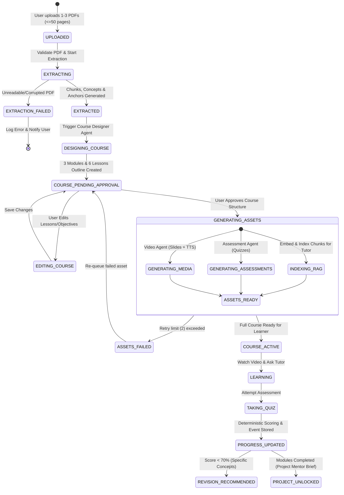
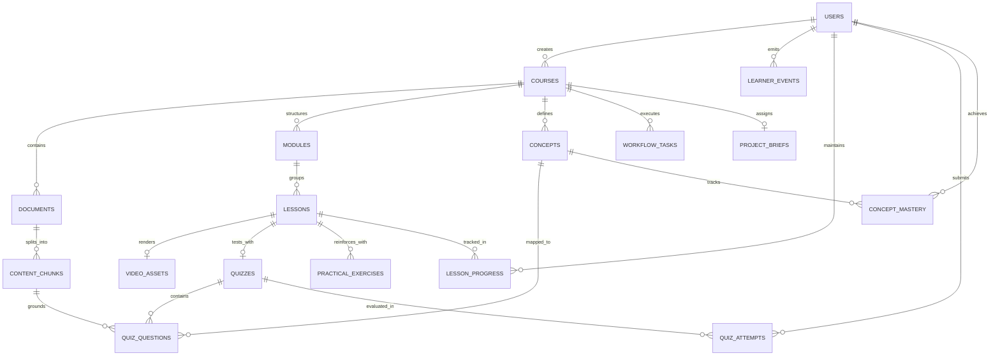

# Task WBS 2.1: System Architecture, Data Model & Agent Integration Contracts

### Member Information
- **Member Name:** Member 1
- **Role:** Project Manager and Backend/Deployment Engineer
- **Assigned Work Package (WBS):** WBS 2.1 (Design Architecture, Data Model, and Integration Contracts)
- **Task Name:** System Architecture, Data Model, and Integration Contracts
- **Week:** Weeks 3–4
- **Execution Mode:** Special Override (Sole executor of WBS 1 & WBS 2)
- **Status:** COMPLETED

---

## 1. Task Objective

Establish the foundational architectural blueprint, persistent data structures, and typed communication standards for Eduvance AI. This includes:
1. The **Layered System Topology** (Client Presentation, API Gateway, Orchestrator, Agent Services, Storage).
2. The **Central Workflow Controller State Machine** (asynchronous lifecycle, retry policy $\le$ 2, error logging).
3. The **Relational Data Model & ERD** (guaranteeing source traceability from chunks to lessons, quizzes, and tutor responses).
4. Strict, typed **Agent Integration Contracts** (JSON Schemas) defining input/output interfaces for all 7 platform agents.

---

## 2. Requirements & Scope Boundaries

* **Target Course Scale:** Up to 3 uploaded text-based PDFs ($\le$ 50 pages total), generating ~3 modules, ~6 lessons.
* **Deterministic Rules:** Progress, scoring, and revision recommendations are calculated deterministically rather than delegated to probabilistic LLM judgments.
* **Traceability:** Every learning objective, quiz question, and tutor answer must reference originating `document_id`, `page_number`, and `chunk_id`.
* **Resilience:** The state machine monitors task progression (`PENDING`, `RUNNING`, `COMPLETED`, `FAILED`) with automatic retries capped at 2.

---

## 3. Technology Stack Selection

| Component | Selected Technology | Rationale |
| :--- | :--- | :--- |
| **Backend Framework** | Python (FastAPI) | High asynchronous throughput, native Pydantic v2 validation, OpenAPI/Swagger auto-generation. |
| **Relational Database**| PostgreSQL (SQLAlchemy 2.0 / Alembic) | ACID compliance for events/progress, relational integrity, JSONB support for agent payloads. *(SQLite compatible for local dev)* |
| **Vector Indexing** | pgvector / FAISS | Local or embedded vector search for chunk embeddings without external cloud lock-in. |
| **Agent Contracts** | Pydantic v2 + JSON Schema Draft 2020-12 | Runtime validation, automatic serialization, language-agnostic interface definitions. |
| **Asset Storage** | Local File System / Object Storage | File directory structure for source PDFs, slide renders, TTS audio files, and MP4 video assets. |

---

## 4. Layered System Architecture

```mermaid
flowchart TD
    subgraph ClientLayer ["1. Presentation Layer (Member 4 - Frontend)"]
        UI_Upload["Document Upload Screen"]
        UI_Review["Course Review & Approval Screen"]
        UI_Player["Lesson Player & Video Screen"]
        UI_Tutor["Source-Grounded Tutor Chat"]
        UI_Quiz["Quiz & Assessment Screen"]
        UI_Dashboard["Progress & Project Roadmap Screen"]
    end

    subgraph APILayer ["2. API & Gateway Layer (Member 1 - Backend)"]
        Router["FastAPI REST Endpoints"]
        AuthMiddleware["Auth & Tenant Isolation Middleware"]
        EventLogger["Learner Event Ingestion API"]
    end

    subgraph ControllerLayer ["3. Central Workflow Controller (Member 1 - Backend)"]
        WorkflowEngine["Asynchronous State Machine & Job Runner"]
        StateTracker["Job Execution & Retry Monitor"]
    end

    subgraph AgentLayer ["4. Agentic AI Processing Services"]
        Agent_Content["Content Agent (M2)\nExtraction, Chunking & Concepts"]
        Agent_Course["Course Designer Agent (M2)\nModules, Lessons & Objectives"]
        Agent_Video["Video Pipeline Agent (M3)\nScripts, Slides, Narration, Captions"]
        Agent_Tutor["Tutor Agent (M2)\nRAG Retrieval & Grounded Q&A"]
        Agent_Assessment["Assessment Agent (M3)\nMCQs, T/F & Practical Rubrics"]
        Engine_Progress["Progress & Recommendation Engine (M1)\nDeterministic Scoring & Mastery Rules"]
        Agent_Project["Project Mentor Agent (M3)\nCapstone Brief & Roadmap"]
    end

    subgraph DataLayer ["5. Persistence & Storage Layer (Member 1)"]
        PostgresDB[(Relational DB\nUsers, Courses, Lessons, Quizzes, Events)]
        VectorStore[(Vector Store / Chunks Index)]
        BlobStorage[(Asset File Storage\nPDFs, Slides, Audio, Video MP4)]
    end

    ClientLayer <-->|HTTP / REST / JSON| APILayer
    APILayer <--> ControllerLayer
    APILayer <--> DataLayer
    ControllerLayer <--> AgentLayer
    AgentLayer <--> DataLayer
```



---

## 5. Workflow Controller State Machine



---

## 6. Entity-Relationship Data Model (ERD)



---

## 7. Relational Table Specifications

### 7.1 `users`
* `id`: UUID (PK, `gen_random_uuid()`)
* `email`: VARCHAR(255) (UNIQUE, NOT NULL)
* `password_hash`: VARCHAR(255) (NOT NULL)
* `full_name`: VARCHAR(150) (NOT NULL)
* `role`: VARCHAR(30) (NOT NULL, DEFAULT 'LEARNER')
* `created_at`: TIMESTAMPTZ (NOT NULL, DEFAULT NOW())

### 7.2 `courses`
* `id`: UUID (PK, `gen_random_uuid()`)
* `user_id`: UUID (FK -> users.id, NOT NULL)
* `title`: VARCHAR(255) (NOT NULL)
* `description`: TEXT (NULL)
* `domain`: VARCHAR(100) (NOT NULL)
* `status`: VARCHAR(30) (NOT NULL, DEFAULT 'DRAFT')
* `created_at`: TIMESTAMPTZ (NOT NULL, DEFAULT NOW())
* `updated_at`: TIMESTAMPTZ (NOT NULL, DEFAULT NOW())

### 7.3 `documents`
* `id`: UUID (PK, `gen_random_uuid()`)
* `course_id`: UUID (FK -> courses.id, ON DELETE CASCADE)
* `filename`: VARCHAR(255) (NOT NULL)
* `file_path`: TEXT (NOT NULL)
* `file_hash_sha256`: VARCHAR(64) (NOT NULL)
* `page_count`: INTEGER (NOT NULL)
* `file_size_bytes`: BIGINT (NOT NULL)
* `upload_status`: VARCHAR(30) (NOT NULL, DEFAULT 'UPLOADED')
* `created_at`: TIMESTAMPTZ (NOT NULL, DEFAULT NOW())

### 7.4 `content_chunks`
* `id`: UUID (PK, `gen_random_uuid()`)
* `document_id`: UUID (FK -> documents.id, ON DELETE CASCADE)
* `chunk_index`: INTEGER (NOT NULL)
* `page_number`: INTEGER (NOT NULL)
* `text_content`: TEXT (NOT NULL)
* `token_count`: INTEGER (NOT NULL)
* `embedding_id`: VARCHAR(100) (NULL)
* `metadata_json`: JSONB (DEFAULT '{}')
* `created_at`: TIMESTAMPTZ (NOT NULL, DEFAULT NOW())

### 7.5 `concepts`
* `id`: UUID (PK, `gen_random_uuid()`)
* `course_id`: UUID (FK -> courses.id, ON DELETE CASCADE)
* `name`: VARCHAR(150) (NOT NULL)
* `description`: TEXT (NOT NULL)
* `difficulty`: VARCHAR(20) (DEFAULT 'BEGINNER')
* `prerequisite_concept_ids`: JSONB (DEFAULT '[]')
* `source_chunk_ids`: JSONB (DEFAULT '[]')

### 7.6 `modules`
* `id`: UUID (PK, `gen_random_uuid()`)
* `course_id`: UUID (FK -> courses.id, ON DELETE CASCADE)
* `title`: VARCHAR(255) (NOT NULL)
* `sequence_order`: INTEGER (NOT NULL)
* `description`: TEXT (NULL)

### 7.7 `lessons`
* `id`: UUID (PK, `gen_random_uuid()`)
* `module_id`: UUID (FK -> modules.id, ON DELETE CASCADE)
* `title`: VARCHAR(255) (NOT NULL)
* `sequence_order`: INTEGER (NOT NULL)
* `estimated_minutes`: INTEGER (DEFAULT 10)
* `learning_objectives`: JSONB (NOT NULL, DEFAULT '[]')
* `target_concept_ids`: JSONB (NOT NULL, DEFAULT '[]')
* `source_chunk_ids`: JSONB (NOT NULL, DEFAULT '[]')

### 7.8 `video_assets`
* `id`: UUID (PK, `gen_random_uuid()`)
* `lesson_id`: UUID (FK -> lessons.id, ON DELETE CASCADE)
* `script_json`: JSONB (NOT NULL)
* `slide_deck_json`: JSONB (NOT NULL)
* `audio_path`: TEXT (NULL)
* `srt_subtitles_path`: TEXT (NULL)
* `video_path`: TEXT (NULL)
* `duration_seconds`: INTEGER (DEFAULT 0)
* `generation_status`: VARCHAR(30) (DEFAULT 'PENDING')
* `error_message`: TEXT (NULL)

### 7.9 `quizzes` & `quiz_questions`
* `quizzes.id`: UUID (PK)
* `quizzes.lesson_id`: UUID (FK -> lessons.id, UNIQUE)
* `quizzes.passing_score`: INTEGER (DEFAULT 70)
* `quiz_questions.id`: UUID (PK)
* `quiz_questions.quiz_id`: UUID (FK -> quizzes.id, ON DELETE CASCADE)
* `quiz_questions.question_text`: TEXT (NOT NULL)
* `quiz_questions.question_type`: VARCHAR(20) (NOT NULL: MCQ, TRUE_FALSE)
* `quiz_questions.options`: JSONB (NOT NULL)
* `quiz_questions.correct_answer`: TEXT (NOT NULL)
* `quiz_questions.explanation`: TEXT (NOT NULL)
* `quiz_questions.target_concept_id`: UUID (FK -> concepts.id, NULL)
* `quiz_questions.source_chunk_id`: UUID (FK -> content_chunks.id, NULL)
* `quiz_questions.sequence_order`: INTEGER (NOT NULL)

### 7.10 `practical_exercises`
* `id`: UUID (PK, `gen_random_uuid()`)
* `lesson_id`: UUID (FK -> lessons.id, ON DELETE CASCADE)
* `prompt`: TEXT (NOT NULL)
* `deliverable_description`: TEXT (NOT NULL)
* `starter_template`: TEXT (NULL)
* `rubric_criteria`: JSONB (NOT NULL)

### 7.11 `project_briefs`
* `id`: UUID (PK, `gen_random_uuid()`)
* `course_id`: UUID (FK -> courses.id, UNIQUE)
* `title`: VARCHAR(255) (NOT NULL)
* `scenario_description`: TEXT (NOT NULL)
* `deliverables`: JSONB (NOT NULL)
* `milestone_roadmap`: JSONB (NOT NULL)
* `rubric`: JSONB (NOT NULL)

### 7.12 `learner_events`
* `id`: UUID (PK, `gen_random_uuid()`)
* `user_id`: UUID (FK -> users.id, NOT NULL)
* `course_id`: UUID (FK -> courses.id, NOT NULL)
* `lesson_id`: UUID (FK -> lessons.id, NULL)
* `event_type`: VARCHAR(50) (NOT NULL)
* `payload`: JSONB (NOT NULL)
* `created_at`: TIMESTAMPTZ (NOT NULL, DEFAULT NOW())

### 7.13 `lesson_progress` & `concept_mastery`
* `lesson_progress`: `id` (PK), `user_id` (FK), `lesson_id` (FK), `status` ('NOT_STARTED', 'IN_PROGRESS', 'COMPLETED'), `video_completed` (BOOL), `quiz_completed` (BOOL), `updated_at`.
* `concept_mastery`: `id` (PK), `user_id` (FK), `concept_id` (FK), `mastery_score` (FLOAT), `needs_revision` (BOOL), `last_evaluated_at`.

### 7.14 `workflow_tasks`
* `id`: UUID (PK, `gen_random_uuid()`)
* `course_id`: UUID (FK -> courses.id, NOT NULL)
* `task_type`: VARCHAR(50) (NOT NULL)
* `status`: VARCHAR(30) (NOT NULL, DEFAULT 'PENDING')
* `retry_count`: INTEGER (DEFAULT 0)
* `error_log`: TEXT (NULL)
* `started_at`: TIMESTAMPTZ (NULL)
* `completed_at`: TIMESTAMPTZ (NULL)

---

## 8. Agent Integration Contracts (JSON Schemas)

### Contract 1: Content Agent (Member 2)
```json
{
  "$schema": "https://json-schema.org/draft/2020-12/schema",
  "title": "ContentExtractionOutput",
  "type": "object",
  "required": ["course_id", "chunks", "concepts"],
  "properties": {
    "course_id": { "type": "string", "format": "uuid" },
    "chunks": {
      "type": "array",
      "items": {
        "type": "object",
        "required": ["chunk_id", "document_id", "chunk_index", "page_number", "text_content", "token_count"],
        "properties": {
          "chunk_id": { "type": "string", "format": "uuid" },
          "document_id": { "type": "string", "format": "uuid" },
          "chunk_index": { "type": "integer", "minimum": 0 },
          "page_number": { "type": "integer", "minimum": 1 },
          "text_content": { "type": "string", "minLength": 50 },
          "token_count": { "type": "integer", "minimum": 1 },
          "section_header": { "type": "string" }
        }
      }
    },
    "concepts": {
      "type": "array",
      "items": {
        "type": "object",
        "required": ["concept_id", "name", "description", "difficulty", "prerequisite_names", "source_chunk_ids"],
        "properties": {
          "concept_id": { "type": "string", "format": "uuid" },
          "name": { "type": "string", "minLength": 2 },
          "description": { "type": "string", "minLength": 10 },
          "difficulty": { "type": "string", "enum": ["BEGINNER", "INTERMEDIATE", "ADVANCED"] },
          "prerequisite_names": { "type": "array", "items": { "type": "string" } },
          "source_chunk_ids": { "type": "array", "items": { "type": "string", "format": "uuid" } }
        }
      }
    }
  }
}
```

### Contract 2: Course Designer Agent (Member 2)
```json
{
  "$schema": "https://json-schema.org/draft/2020-12/schema",
  "title": "CourseDesignOutput",
  "type": "object",
  "required": ["course_title", "description", "modules"],
  "properties": {
    "course_title": { "type": "string", "minLength": 5 },
    "description": { "type": "string", "minLength": 20 },
    "modules": {
      "type": "array",
      "minItems": 2,
      "maxItems": 4,
      "items": {
        "type": "object",
        "required": ["module_sequence", "title", "description", "lessons"],
        "properties": {
          "module_sequence": { "type": "integer", "minimum": 1 },
          "title": { "type": "string" },
          "description": { "type": "string" },
          "lessons": {
            "type": "array",
            "minItems": 1,
            "maxItems": 3,
            "items": {
              "type": "object",
              "required": ["lesson_sequence", "title", "learning_objectives", "target_concept_ids", "source_chunk_ids", "estimated_minutes"],
              "properties": {
                "lesson_sequence": { "type": "integer", "minimum": 1 },
                "title": { "type": "string" },
                "estimated_minutes": { "type": "integer", "minimum": 5, "maximum": 30 },
                "learning_objectives": { "type": "array", "minItems": 2, "items": { "type": "string" } },
                "target_concept_ids": { "type": "array", "items": { "type": "string", "format": "uuid" } },
                "source_chunk_ids": { "type": "array", "items": { "type": "string", "format": "uuid" } }
              }
            }
          }
        }
      }
    }
  }
}
```

### Contract 3: Video Agent (Member 3)
```json
{
  "$schema": "https://json-schema.org/draft/2020-12/schema",
  "title": "LessonVideoAssetOutput",
  "type": "object",
  "required": ["lesson_id", "total_estimated_seconds", "slides"],
  "properties": {
    "lesson_id": { "type": "string", "format": "uuid" },
    "total_estimated_seconds": { "type": "integer", "maximum": 420 },
    "slides": {
      "type": "array",
      "minItems": 3,
      "maxItems": 8,
      "items": {
        "type": "object",
        "required": ["slide_number", "header", "bullet_points", "narration_script", "source_chunk_id"],
        "properties": {
          "slide_number": { "type": "integer", "minimum": 1 },
          "header": { "type": "string" },
          "bullet_points": { "type": "array", "minItems": 2, "maxItems": 5, "items": { "type": "string" } },
          "visual_cue": { "type": "string" },
          "narration_script": { "type": "string", "minLength": 20 },
          "source_chunk_id": { "type": "string", "format": "uuid" }
        }
      }
    }
  }
}
```

### Contract 4: Tutor Agent (Member 2)
```json
{
  "$schema": "https://json-schema.org/draft/2020-12/schema",
  "title": "TutorResponseOutput",
  "type": "object",
  "required": ["answer", "is_abstention", "confidence_score", "citations"],
  "properties": {
    "answer": { "type": "string", "minLength": 5 },
    "is_abstention": { "type": "boolean" },
    "abstention_reason": { "type": "string" },
    "confidence_score": { "type": "number", "minimum": 0.0, "maximum": 1.0 },
    "citations": {
      "type": "array",
      "items": {
        "type": "object",
        "required": ["chunk_id", "document_name", "page_number", "matched_text_excerpt"],
        "properties": {
          "chunk_id": { "type": "string", "format": "uuid" },
          "document_name": { "type": "string" },
          "page_number": { "type": "integer", "minimum": 1 },
          "matched_text_excerpt": { "type": "string" }
        }
      }
    }
  }
}
```

### Contract 5: Assessment Agent (Member 3)
```json
{
  "$schema": "https://json-schema.org/draft/2020-12/schema",
  "title": "AssessmentPackageOutput",
  "type": "object",
  "required": ["lesson_id", "quiz", "practical_exercise"],
  "properties": {
    "lesson_id": { "type": "string", "format": "uuid" },
    "quiz": {
      "type": "object",
      "required": ["passing_score_percentage", "questions"],
      "properties": {
        "passing_score_percentage": { "type": "integer", "default": 70 },
        "questions": {
          "type": "array",
          "minItems": 4,
          "maxItems": 8,
          "items": {
            "type": "object",
            "required": ["question_number", "question_type", "question_text", "options", "correct_answer", "explanation", "target_concept_id", "source_chunk_id"],
            "properties": {
              "question_number": { "type": "integer", "minimum": 1 },
              "question_type": { "type": "string", "enum": ["MCQ", "TRUE_FALSE"] },
              "question_text": { "type": "string" },
              "options": { "type": "array", "minItems": 2, "maxItems": 4, "items": { "type": "string" } },
              "correct_answer": { "type": "string" },
              "explanation": { "type": "string" },
              "target_concept_id": { "type": "string", "format": "uuid" },
              "source_chunk_id": { "type": "string", "format": "uuid" }
            }
          }
        }
      }
    },
    "practical_exercise": {
      "type": "object",
      "required": ["prompt", "deliverable_description", "rubric_criteria"],
      "properties": {
        "prompt": { "type": "string" },
        "deliverable_description": { "type": "string" },
        "starter_template": { "type": "string" },
        "rubric_criteria": {
          "type": "array",
          "minItems": 2,
          "items": {
            "type": "object",
            "required": ["criterion", "points", "description"],
            "properties": {
              "criterion": { "type": "string" },
              "points": { "type": "integer", "minimum": 1 },
              "description": { "type": "string" }
            }
          }
        }
      }
    }
  }
}
```

### Contract 6: Progress & Recommendation Engine (Member 1)
```json
{
  "$schema": "https://json-schema.org/draft/2020-12/schema",
  "title": "ProgressEvaluationOutput",
  "type": "object",
  "required": ["user_id", "course_id", "overall_completion_percentage", "concept_mastery_summary", "recommendations"],
  "properties": {
    "user_id": { "type": "string", "format": "uuid" },
    "course_id": { "type": "string", "format": "uuid" },
    "overall_completion_percentage": { "type": "number", "minimum": 0.0, "maximum": 100.0 },
    "concept_mastery_summary": {
      "type": "array",
      "items": {
        "type": "object",
        "required": ["concept_id", "concept_name", "score_percentage", "needs_revision"],
        "properties": {
          "concept_id": { "type": "string", "format": "uuid" },
          "concept_name": { "type": "string" },
          "score_percentage": { "type": "number", "minimum": 0.0, "maximum": 100.0 },
          "needs_revision": { "type": "boolean" }
        }
      }
    },
    "recommendations": {
      "type": "array",
      "items": {
        "type": "object",
        "required": ["lesson_id", "lesson_title", "trigger_concept", "trigger_quiz_score", "reason"],
        "properties": {
          "lesson_id": { "type": "string", "format": "uuid" },
          "lesson_title": { "type": "string" },
          "trigger_concept": { "type": "string" },
          "trigger_quiz_score": { "type": "number" },
          "reason": { "type": "string" }
        }
      }
    }
  }
}
```

### Contract 7: Project Mentor Agent (Member 3)
```json
{
  "$schema": "https://json-schema.org/draft/2020-12/schema",
  "title": "CapstoneProjectBriefOutput",
  "type": "object",
  "required": ["course_id", "project_title", "scenario", "deliverables", "roadmap", "rubric"],
  "properties": {
    "course_id": { "type": "string", "format": "uuid" },
    "project_title": { "type": "string" },
    "scenario": { "type": "string", "minLength": 50 },
    "deliverables": { "type": "array", "minItems": 2, "items": { "type": "string" } },
    "roadmap": {
      "type": "array",
      "minItems": 3,
      "items": {
        "type": "object",
        "required": ["milestone_number", "title", "description", "concepts_applied"],
        "properties": {
          "milestone_number": { "type": "integer", "minimum": 1 },
          "title": { "type": "string" },
          "description": { "type": "string" },
          "concepts_applied": { "type": "array", "items": { "type": "string" } }
        }
      }
    },
    "rubric": {
      "type": "array",
      "items": {
        "type": "object",
        "required": ["category", "weight_percentage", "criteria"],
        "properties": {
          "category": { "type": "string" },
          "weight_percentage": { "type": "integer" },
          "criteria": { "type": "string" }
        }
      }
    }
  }
}
```

---

## 9. Downstream Task Continuity

1. **WBS 2.2 (Member 4 - UI/UX):** Directly uses the state machine transitions and entity fields to produce wireframes and user journeys.
2. **WBS 2.3 (Member 3 - Generative Media):** Feasibility experiments for slide formatting, narration, and latency directly benchmark Contract 3.
3. **WBS 3.1 (Member 1 - Backend & Database Setup):** Direct translation of Section 7 schemas into SQLAlchemy 2.0 models and migration scripts.
