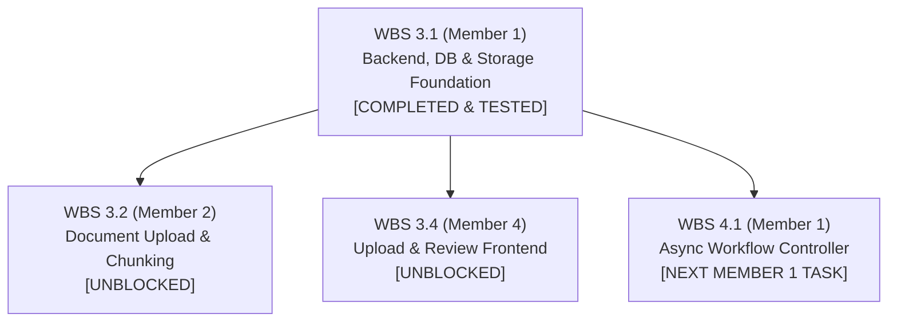

# Task WBS 3.1: Environment, Database, and Storage Setup

### Member Information
- **Member Name:** Member 1
- **Role:** Project Manager and Backend/Deployment Engineer
- **Assigned Work Package (WBS):** WBS 3.1 (Set up repository, environments, database, accounts, and storage)
- **Task Name:** Environment, Database, and Storage Setup
- **Week:** Weeks 3–5
- **Status:** COMPLETED for Local Foundation & Tested (71 Passing Tests)

---

## 1. Executive Summary & Objective

WBS 3.1 establishes the production-grade backend, persistence, security, and storage foundation for the **Eduvance AI** platform. Built upon the architectural blueprints and interface contracts finalized in **WBS 2.1**, this work package delivers a fully functional, tested, and reproducible core that serves as the runtime backbone for all subsequent agentic components (Content Extraction, Course Design, Video Generation, Tutor RAG, and Assessment).

### Core Deliverables Achieved:
1. **Modular Codebase Scaffolding:** Clean separation between production application directories (`Backend/`, `Database/`, `AI_Modules/`, `Frontend/`, `Documentation/`) and internal team documentation (`members/`).
2. **Environment & Settings Configuration:** Pydantic Settings v2 configuration with collision-resistant `EDUVANCE_` prefixing and validated `.env.example`.
3. **Relational Database & Migrations:** Complete SQLAlchemy 2.0 ORM models implementing all 14 entities (16 relational tables) with Alembic migration versioning (`0001_initial_schema.py`) and automated round-trip schema verification.
4. **FastAPI Application Lifecycle & Health Probes:** Robust app factory (`create_app`) featuring decoupled liveness (`/health/live`) and database-verified readiness (`/health/ready`) probes.
5. **Secure Authentication & Identity Isolation:** User registration, constant-time credential checks, direct salted `bcrypt` hashing, and cryptographic JWT access tokens (`/api/v1/auth`).
6. **Multi-Tenant Course Ownership:** Multi-user isolation where all course resources are strictly scoped to their authenticated owners, with 404 sanitization against unauthorized enumeration.
7. **Hardened File Storage & Document Access:** Local storage service hardened against path traversal and Windows reserved device names, paired with secure streaming downloads and public metadata listing endpoints (`/api/v1/courses/{id}/documents`).
8. **Clean-Environment Reproducibility:** 71 passing automated tests verified across clean, independent virtual environments with pinned dependency constraints (`constraints-windows-py313.txt`).

---

## 2. Environment Configuration & Settings Management

### 2.1 Prefixing & Collision Prevention
The application configuration (`Backend/core/config.py`) utilizes **Pydantic Settings v2** to parse environment variables with type validation. During early testing, system-level environment variables (e.g., Windows `DEBUG=release`) collided with internal boolean flags. 

To permanently eliminate collisions while preserving contract integrity:
* Enforced the `EDUVANCE_` environment variable prefix (`env_prefix = "EDUVANCE_"`).
* Updated `Backend/.env.example` with fully prefixed, documented assignments.
* Maintained default fallbacks ensuring zero-configuration local runs with SQLite (`sqlite:///./Database/eduvance.db`).

### 2.2 Configuration Verification (`test_config.py`)
Automated tests verify that:
* `Backend/.env.example` loads values correctly over default placeholders.
* Environment variables take strict precedence over file-based values.
* Sensible development defaults function when no `.env` file is present.

---

## 3. Database Modeling & Migration Infrastructure

### 3.1 Relational Schema Implementation
All 14 entities designed in WBS 2.1 are implemented in `Database/models/all_models.py` using SQLAlchemy 2.0 declarative mappings:

| Table Name | Entity / Role | Key Constraints & Relationships |
| :--- | :--- | :--- |
| `users` | System identity & accounts | Unique lowercase email, bcrypt hash, role (`LEARNER`, `INSTRUCTOR`, `ADMIN`). |
| `courses` | Course learning containers | Foreign key to `users.id` (`ON DELETE CASCADE`), initial status `DRAFT`. |
| `documents` | Uploaded PDF training materials | Foreign key to `courses.id`, SHA-256 integrity hash, page count. |
| `content_chunks` | Atomic text units for RAG/citations | Foreign key to `documents.id`, page number, token count, JSON metadata. |
| `concepts` | Domain concepts & prerequisites | Foreign key to `courses.id`, difficulty level, prerequisite IDs JSON. |
| `modules` | High-level course sections | Foreign key to `courses.id`, sequential ordering index. |
| `lessons` | Structured instructional units | Foreign key to `modules.id`, objectives JSON, target concept IDs JSON. |
| `video_assets` | Generative video deliverables | Unique foreign key to `lessons.id`, script JSON, slide deck JSON, MP4/VTT paths. |
| `quizzes` | Objective lesson evaluations | Unique foreign key to `lessons.id`, passing score threshold (default 70%). |
| `quiz_questions` | MCQs & True/False questions | Foreign key to `quizzes.id`, foreign keys to `concepts` and `content_chunks`. |
| `practical_exercises`| Hands-on milestone prompts | Foreign key to `lessons.id`, rubric criteria JSON. |
| `project_briefs` | Capstone project scenarios | Unique foreign key to `courses.id`, deliverables JSON, milestone roadmap JSON. |
| `learner_events` | Immutable audit log | Foreign key to `users.id`, `courses.id`, `lessons.id`, event payload JSON. |
| `lesson_progress` | Deterministic lesson completion | Unique composite foreign key (`user_id`, `lesson_id`), video/quiz booleans. |
| `concept_mastery` | Concept-level mastery scores | Unique composite foreign key (`user_id`, `concept_id`), `needs_revision` flag. |
| `workflow_tasks` | Async controller task tracking | Foreign key to `courses.id`, task type, status, retry count ($\le 2$), error log. |

### 3.2 Alembic Migration System (`Database/migrations/`)
* **Static Revision `0001_initial_schema.py`:** Generates all 16 tables in explicit topological dependency order, and drops them in reverse order during rollback.
* **SQLite Pragma Enforcement:** The SQLite connection hook automatically executes `PRAGMA foreign_keys=ON;` ensuring foreign-key cascades (`ON DELETE CASCADE`) are strictly respected locally.
* **Automated Verification Script (`verify_sqlite_setup.py`):** Runs programmatic CLI migrations on a fresh disposable database: tests upgrade to head $\rightarrow$ verifies 16 tables present $\rightarrow$ downgrades to base $\rightarrow$ re-upgrades to head.

---

## 4. Application Lifecycle & Startup Readiness

### 4.1 Application Factory (`Backend/main.py`)
The FastAPI application is instantiated via `create_app(settings_override=None, engine_override=None, storage_override=None)`, enabling clean dependency injection in test suites without mutating global singletons.

### 4.2 Decoupled Health Probes
* **Liveness Probe (`GET /health/live`):** Returns HTTP 200 immediately to signal the web server process is running and accepting HTTP traffic.
* **Readiness Probe (`GET /health/ready`):** Returns HTTP 200 only if:
  1. The database connection can be established.
  2. The current Alembic database revision matches the migration head (`0001_initial_schema`).
  3. Zero-row queries succeed against every mapped table.
* If the database is missing, corrupted, or unmigrated, `/health/ready` safely returns HTTP 503 without leaking connection strings or internal tracebacks, allowing orchestrators (Kubernetes/Docker) to wait for readiness.

---

## 5. User Authentication & Identity Management

### 5.1 Direct bcrypt Password Security
During implementation, the legacy `passlib` wrapper failed compatibility checks against installed `bcrypt 5.0.0` on Python 3.13 due to internal version-parsing bugs. 

**Architectural Decision:** Replaced `passlib` with direct, standard `bcrypt` API calls (`bcrypt.hashpw` and `bcrypt.checkpw`):
* Enforces minimum 12-character passwords and maximum 72-byte UTF-8 boundaries.
* Mitigates timing attacks by executing a dummy bcrypt comparison when an unregistered email is queried.
* Validates emails using `email-validator` with automatic lowercase normalization.

### 5.2 Cryptographic JWT Token Engine
* Implemented via `python-jose` using `HS256`.
* Enforces strict claims: Subject (`sub`), Issuer (`iss`), Audience (`aud`), Token Type (`access`), Issued At (`iat`), and Expiration (`exp`).
* Rejects tokens signed with short, blank, or placeholder default keys.

### 5.3 Authentication Endpoints (`/api/v1/auth`)
* `POST /api/v1/auth/register`: Creates new `LEARNER` account; rejects duplicate emails.
* `POST /api/v1/auth/login`: Authenticates credentials; returns Bearer JWT.
* `GET /api/v1/auth/me`: Authenticated endpoint returning current user profile (`id`, `email`, `full_name`, `role`).

---

## 6. Course Management & Ownership Isolation

### 6.1 Multi-Tenant Data Isolation
In `Backend/courses.py`, all course operations enforce ownership boundary checks:
* `POST /api/v1/courses`: Creates a course container bound exclusively to the authenticated user's ID with initial status `DRAFT`.
* `GET /api/v1/courses`: Lists courses belonging strictly to the requesting user, with bounded pagination (`limit` default 20, max 100).
* `GET /api/v1/courses/{course_id}`: Reusable `owned_course` dependency queries `WHERE id = :course_id AND user_id = :user_id`.

### 6.2 Enumeration Defense (404 vs 403)
Attempting to access a course ID belonging to another user returns an identical **HTTP 404 Not Found** (rather than 403 Forbidden). This prevents attackers from guessing valid course IDs across accounts.

---

## 7. Hardened File Storage & Document Access Services

### 7.1 Path Traversal Defense (`Backend/services/storage_service.py`)
The storage service manages files within `Backend/storage/` with strict multi-layer security:
* **Directory Isolation:** Files are stored in course-specific directories (`Backend/storage/uploads/{course_id}/`).
* **Traversal Rejection:** Rejects path traversal (`..`), forward/backward slashes in filenames, and drive letters (`C:`).
* **Windows Device Name Rejection:** Blocks Windows reserved file and directory names (`CON`, `PRN`, `AUX`, `NUL`, `COM1-9`, `LPT1-9`).
* **Confinement Checks:** Uses `os.path.commonpath` to guarantee resolved paths are strictly contained inside the authorized course directory.

### 7.2 Document Delivery Endpoints (`Backend/documents.py`)
* `GET /api/v1/courses/{course_id}/documents`: Lists public metadata of uploaded documents (ID, filename, page count, file size, status, and download URL). Internal file paths and server hashes are never exposed.
* `GET /api/v1/courses/{course_id}/documents/{document_id}/download`: Verifies course ownership $\rightarrow$ confirms document membership $\rightarrow$ safely streams the file in 64 KiB chunks with `Cache-Control: private, no-store`.

---

## 8. Clean-Environment Reproducibility & Testing Evidence

### 8.1 Automated Test Suite Results
The full test suite was validated across Python 3.13 environments:

```powershell
.\.venv\Scripts\python.exe -m pytest Backend/tests -v
```

```text
================== 71 passed, 1 skipped, 1 warning in 17.60s ==================
```

### 8.2 Test Coverage Breakdown

| Test File | Test Count | Areas Verified |
| :--- | :---: | :--- |
| `test_app.py` | 6 | Lifespan startup/shutdown, `/health/live`, `/health/ready`, unmigrated DB 503, recovery. |
| `test_auth.py` | 19 | Registration, duplicate emails, password bounds, bcrypt timing, token validation, invalid signatures. |
| `test_config.py` | 3 | Template loading, environment variable precedence, default fallbacks. |
| `test_courses.py` | 4 | Two-user ownership isolation, status injection prevention, route authentication, pagination. |
| `test_documents.py` | 7 | Owner-authorized streaming download, cross-user denial, path traversal rejection, metadata listing. |
| `test_migrations.py` | 3 | Migration 0001 upgrade/downgrade, foreign-key cascades, offline SQL generation. |
| `test_storage_service.py` | 30 | Normal saves/lookups, Windows device names, traversal payloads, course deletion cleanup. |
| **Total** | **72** | **71 Passed, 1 Skipped (Windows unprivileged symlink test, expected on Win32)** |

### 8.3 Exact Dependency Snapshot
To guarantee 100% reproducible builds across team members, the complete 58-package distribution set was captured in `Backend/constraints-windows-py313.txt`. Testing confirmed that creating a fresh environment with these constraints produces an exact byte-for-byte package match.

---

## 9. Downstream Task Handoff & Alignment

WBS 3.1 successfully unlocks the following downstream tasks:



1. **For Member 2 (WBS 3.2 — Document Upload & Chunking):**
   * Can directly ingest files via `StorageService.save_upload` and store chunk records in `content_chunks`.
2. **For Member 4 (WBS 3.4 — Frontend Upload & Review Screens):**
   * Can integrate with `/api/v1/auth` (login/register), `/api/v1/courses` (create/list), and `/api/v1/courses/{id}/documents`.
3. **For Member 1 (Next Milestone — WBS 4.1: Workflow Execution Engine):**
   * Ready to implement the asynchronous state machine orchestrating agent handoffs and retry tracking via the `workflow_tasks` table.
