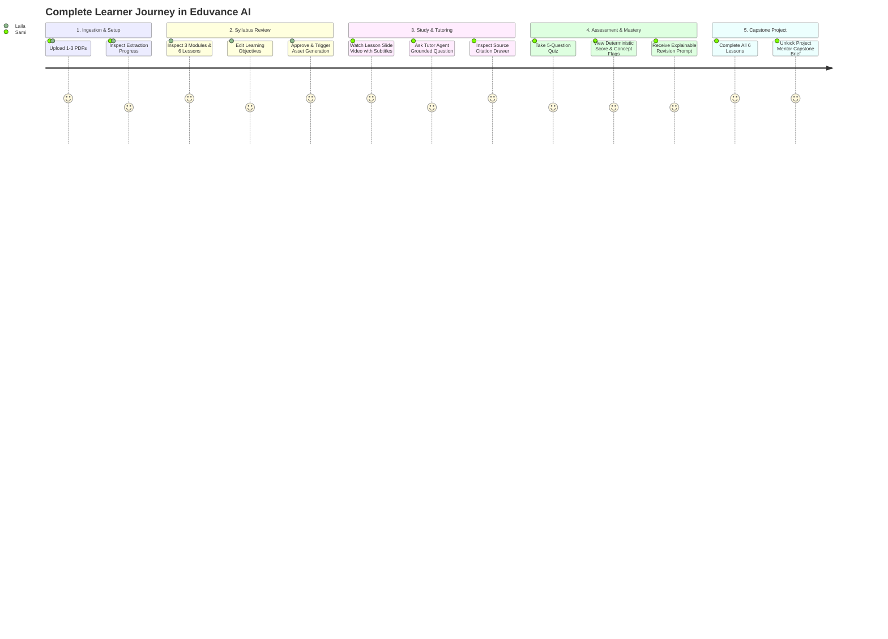

# Task WBS 2.2: User Journeys, Wireframes & Reusable Interface Components

### Member Information
- **Member Name:** Member 4
- **Role:** Frontend and User Experience Engineer
- **Assigned Work Package (WBS):** WBS 2.2 (Design User Journeys, Wireframes, and Reusable Interface Components)
- **Task Name:** User Journeys, Wireframes, and Reusable Interface Components
- **Week:** Weeks 3–4
- **Execution Mode:** Special Override (Executed by Member 1 on behalf of Member 4)
- **Status:** COMPLETED

---

## 1. Task Objective

Establish the comprehensive user experience (UX) architecture, interaction flows, visual screen wireframes, and design system tokens for Eduvance AI. This ensures that:
1. Both **Learners** and **Course Creators / Instructors** have seamless, accessible, and intuitive user journeys.
2. Every core platform screen is visually defined with explicit component states, source attribution elements, and error-handling paths.
3. A modular, accessible design system (**Tailwind CSS + Shadcn UI / Radix**) is established for frontend implementation in **WBS 3.4**, **WBS 4.4**, and **WBS 5.5**.

---

## 2. Target Personas

### Persona 1: "Sami" — The Self-Paced University Learner
* **Background:** 3rd-year Computer Science student studying dense lecture notes and reference textbooks.
* **Goals:** Quick concept synthesis, video summaries for key topics, immediate clarification with verifiable citations, and hands-on self-assessment.
* **Frustrations:** Hallucinated answers in generic AI tools, lack of source page references, overwhelming unstructured PDFs.

### Persona 2: "Dr. Laila" — The Course Creator & Academic Instructor
* **Background:** University lecturer preparing supplementary digital modules from course handouts and syllabus documents.
* **Goals:** Rapid curriculum generation, ability to inspect and edit lesson learning objectives before publishing, and guaranteed alignment with source texts.
* **Frustrations:** Tedious manual slide creation, lack of control over AI-generated lesson plans.

---

## 3. End-to-End User Journey Flow



---

## 4. Screen Inventory & Mid-Fidelity Wireframes

Eduvance AI consists of **6 primary user interfaces**:

---

### Screen 1: Document Upload & Ingestion View (`/upload`)
* **State:** Pre-processing and file ingestion validation.

```text
+-----------------------------------------------------------------------------------+
|  Eduvance AI                   [Courses]  [Dashboard]          [Profile: Sami v]  |
+-----------------------------------------------------------------------------------+
|                                                                                   |
|   Upload Training Materials                                                      |
|   Transform up to 3 PDF documents (max 50 pages total) into a structured course.  |
|                                                                                   |
|   + - - - - - - - - - - - - - - - - - - - - - - - - - - - - - - - - - - - - - +   |
|   |                                                                           |   |
|   |        [ Upload Icon ]                                                    |   |
|   |        Drag and drop your PDF files here, or [Browse Files]               |   |
|   |        Supported: Text-based PDFs | Limit: 3 files, <= 50 pages total     |   |
|   |                                                                           |   |
|   + - - - - - - - - - - - - - - - - - - - - - - - - - - - - - - - - - - - - - +   |
|                                                                                   |
|   Uploaded Documents (2 / 3):                                                     |
|   +----------------------------------------------------+----------------------+   |
|   | File 1: Data_Structures_Week1-3.pdf (24 pages)     | [Valid]       [Trash]|   |
|   +----------------------------------------------------+----------------------+   |
|   | File 2: Recursion_and_Trees.pdf (18 pages)         | [Valid]       [Trash]|   |
|   +----------------------------------------------------+----------------------+   |
|                                                                                   |
|   Total Pages: 42 / 50   |   Estimated Processing Time: ~45 seconds               |
|                                                                                   |
|                                          [ Cancel ]   [ Process Documents (->) ]  |
+-----------------------------------------------------------------------------------+
```

---

### Screen 2: Course Structure Review & Customization (`/course/:id/review`)
* **State:** Central workflow controller status `PENDING_APPROVAL`.

```text
+-----------------------------------------------------------------------------------+
|  Eduvance AI                   [< Back to Upload]              [Status: In Review]|
+-----------------------------------------------------------------------------------+
|                                                                                   |
|   Course Outline: Fundamentals of Data Structures & Recursion                    |
|   Generated from 2 uploaded files (42 pages). Review and edit before generation.  |
|                                                                                   |
|   +---------------------------------------------------------------------------+   |
|   | Module 1: Introduction to Linear Structures (2 Lessons)           [Edit]  |   |
|   |   +-------------------------------------------------------------------+   |   |
|   |   | Lesson 1.1: Arrays and Memory Allocation (10 mins)        [Edit]  |   |   |
|   |   |   Objectives: Understand contiguous memory; Compute O(1) access   |   |   |
|   |   |   Sources: Data_Structures_Week1-3.pdf (pp. 3-8) [4 Chunks]       |   |   |
|   |   +-------------------------------------------------------------------+   |   |
|   |   | Lesson 1.2: Dynamic Arrays & Linked Lists (12 mins)       [Edit]  |   |   |
|   |   |   Objectives: Contrast node references vs arrays; Insert at head  |   |   |
|   |   |   Sources: Data_Structures_Week1-3.pdf (pp. 9-16) [6 Chunks]      |   |   |
|   |   +-------------------------------------------------------------------+   |   |
|   +---------------------------------------------------------------------------+   |
|   | Module 2: Recursion and Divide & Conquer (2 Lessons)              [Edit]  |   |
|   +---------------------------------------------------------------------------+   |
|   | Module 3: Trees and Traversal Foundations (2 Lessons)             [Edit]  |   |
|   +---------------------------------------------------------------------------+   |
|                                                                                   |
|   Summary: 3 Modules | 6 Lessons | 14 Core Concepts Identified                    |
|                                                                                   |
|   [ + Add Custom Lesson ]                 [ Save Draft ]   [ Approve & Generate ] |
+-----------------------------------------------------------------------------------+
```

---

### Screen 3: Lesson Player View (`/course/:id/lesson/:lessonId`)
* **State:** Learner viewing synthesized lesson video with synchronized captions.

```text
+-----------------------------------------------------------------------------------+
|  Eduvance AI   |  Course: Data Structures > Lesson 2.1: Recursion Basics          |
+-----------------------------------------------------------------------------------+
|  +--------------------------------------------+  +-----------------------------+  |
|  |                                            |  | Course Navigation           |  |
|  |        [ VIDEO VIEWPORT (16:9) ]           |  |                             |  |
|  |                                            |  | v Module 1: Linear Structs  |  |
|  |   Slide 3 / 6: The Call Stack Lifecycle    |  |   [x] 1.1 Arrays (Done)     |  |
|  |   * Activation Record creation             |  |   [x] 1.2 Linked Lists      |  |
|  |   * Stack overflow risk                    |  |                             |  |
|  |   * LIFO execution unwinding               |  | v Module 2: Recursion       |  |
|  |                                            |  |   [*] 2.1 Recursion Basics  |  |
|  |                                            |  |   [ ] 2.2 Divide & Conquer  |  |
|  |                                            |  |                             |  |
|  |  [Play] [02:14 / 04:30] =======o===== [CC] |  | v Module 3: Trees           |  |
|  +--------------------------------------------+  |   [ ] 3.1 Binary Trees      |  |
|  | Subtitles (Synced VTT):                    |  |   [ ] 3.2 Tree Traversals   |  |
|  | "When a recursive call is made, an         |  +-----------------------------+  |
|  | activation frame is pushed onto the stack."|  | Lesson Actions              |  |
|  +--------------------------------------------+  | [ Ask Tutor Agent ]         |  |
|  Learning Objectives Covered:                 |  | [ Take Lesson Quiz (->) ]   |  |
|  * Identify the base case in a recursive call |  +-----------------------------+  |
|  * Trace call stack frames during unwinding   |  Sources:                      |  |
|                                               |  Recursion_and_Trees.pdf (p.4) |  |
+-----------------------------------------------------------------------------------+
```

---

### Screen 4: Source-Grounded Tutor Chat & Citation Drawer
* **State:** Overlay drawer / split screen for grounded Q&A with explicit abstention banner.

```text
+-----------------------------------------------------------------------------------+
|  Lesson 2.1: Recursion Basics                       [ Close Chat X ]              |
+-----------------------------------------------------------------------------------+
|                                                                                   |
|  [Tutor Agent]: Hello Sami! Ask me anything about Lesson 2.1. All my answers are   |
|  directly grounded in your uploaded documents.                                    |
|                                                                                   |
|  [Sami]: What happens if my function does not have a base case?                   |
|                                                                                   |
|  [Tutor Agent]:                                                                   |
|  Without a base case, recursive calls continue indefinitely until the memory      |
|  allocated for the execution call stack is exhausted, triggering a StackOverflow  |
|  Error.                                                                           |
|                                                                                   |
|  Citations:                                                                       |
|  [ [Doc 2: Recursion_and_Trees.pdf, p. 5 | Chunk #14] ]  <-- (Clickable Badge)    |
|  Confidence: 96% | Status: Grounded                                               |
|                                                                                   |
|  -------------------------------------------------------------------------------  |
|  [ Citation Inspector Drawer - Open ]                                             |
|  "Source Excerpt: In Section 2.2, if no terminating condition is met, each        |
|  call allocates a new stack frame until memory exhaustion results in a fatal      |
|  runtime stack overflow exception."                                               |
|  -------------------------------------------------------------------------------  |
|                                                                                   |
|  [Sami]: Can you explain Dijkstra's algorithm for shortest paths?                 |
|                                                                                   |
|  [Tutor Agent - Abstention]:                                                      |
|  (!) Abstention Notice: Dijkstra's algorithm is not covered in your uploaded      |
|  course documents (Recursion & Data Structures). I can only answer questions       |
|  grounded in your provided training materials.                                     |
|                                                                                   |
|  +-----------------------------------------------------------------+  +--------+  |
|  | Type your question about this lesson...                         |  | [Send] |  |
|  +-----------------------------------------------------------------+  +--------+  |
+-----------------------------------------------------------------------------------+
```

---

### Screen 5: Quiz & Assessment View (`/course/:id/lesson/:lessonId/quiz`)
* **State:** Deterministic evaluation view with immediate source feedback.

```text
+-----------------------------------------------------------------------------------+
|  Eduvance AI   |  Quiz 2.1: Recursion Fundamentals               [Time: No Limit] |
+-----------------------------------------------------------------------------------+
|                                                                                   |
|   Question 3 of 5 (MCQ) - Testing Concept: "Call Stack Execution"                 |
|                                                                                   |
|   What data structure inherently manages recursive function execution?           |
|                                                                                   |
|   ( ) A) FIFO Queue                                                               |
|   (*) B) LIFO Call Stack                                                          |
|   ( ) C) Hash Map                                                                 |
|   ( ) D) Doubly Linked List                                                       |
|                                                                                   |
|   -----------------------------------------------------------------------------   |
|   [x] Correct! (+20 Points)                                                       |
|   Explanation: Recursive functions rely on a Last-In, First-Out (LIFO) call stack |
|   to preserve the state of local variables and return addresses.                  |
|   Grounded Reference: Recursion_and_Trees.pdf (Page 6, Chunk #16)                 |
|   -----------------------------------------------------------------------------   |
|                                                                                   |
|   [ < Previous Question ]                             [ Next Question (->) ]      |
|                                                                                   |
|   Progress: [=============================             ] 60%                      |
+-----------------------------------------------------------------------------------+
```

---

### Screen 6: Progress Dashboard & Capstone Project (`/course/:id/dashboard`)
* **State:** Summary of completion, concept mastery, revision recommendations, and project brief.

```text
+-----------------------------------------------------------------------------------+
|  Eduvance AI                   [Courses]  [Dashboard]          [Profile: Sami v]  |
+-----------------------------------------------------------------------------------+
|                                                                                   |
|   Course Progress: Fundamentals of Data Structures (83% Complete)                 |
|   [========================================================         ]             |
|                                                                                   |
|   +---------------------------------------+  +---------------------------------+  |
|   | Concept Mastery Breakdown             |  | Recommended Revisions           |  |
|   | * Arrays & Contiguous Memory: 100%    |  | (!) Lesson 2.2: Divide & Conquer|  |
|   | * Linked List Pointers:        90%    |  | Reason: Scored 50% on Quiz 2.2  |  |
|   | * Base Case Recursion:         95%    |  | specifically on MergeSort trees.|  |
|   | * Call Stack Unwinding:        85%    |  | [ Review Lesson 2.2 Now ]       |  |
|   | * Divide & Conquer Trees:      50% (!) |                                 |  |
|   +---------------------------------------+  +---------------------------------+  |
|                                                                                   |
|   +---------------------------------------------------------------------------+   |
|   | [UNLOCKED] Capstone Practical Project: Expression Tree Calculator         |   |
|   | Based on your mastered concepts in Linear Structures, Stacks & Trees.     |   |
|   |                                                                           |   |
|   | Objective: Build an in-memory arithmetic parser converting infix to postfix|   |
|   | expressions and evaluating them via recursive tree traversals.            |   |
|   |                                                                           |   |
|   | Milestone Roadmap:                                                        |   |
|   | [x] Milestone 1: Stack-based Shunting Yard Tokenizer                      |   |
|   | [ ] Milestone 2: Binary Expression Tree Construction                      |   |
|   | [ ] Milestone 3: Post-order Recursive Evaluator & Unit Tests              |   |
|   |                                                                           |   |
|   | [ Download Project Brief PDF ]               [ View Evaluation Rubric ]   |   |
|   +---------------------------------------------------------------------------+   |
+-----------------------------------------------------------------------------------+
```

---

## 5. Reusable Component Design System

### 5.1 Design Tokens

| Token Category | Token Name | Value | Purpose |
| :--- | :--- | :--- | :--- |
| **Colors** | `color-primary` | `#2563EB` (Blue 600) | Primary CTA buttons, active state highlights |
| | `color-primary-dark` | `#1D4ED8` (Blue 700) | Button hover states |
| | `color-bg-base` | `#F8FAFC` (Slate 50) | Main background |
| | `color-bg-card` | `#FFFFFF` (White) | Content card backgrounds |
| | `color-text-main` | `#0F172A` (Slate 900)| Headings and primary text |
| | `color-text-muted`| `#64748B` (Slate 500)| Metadata, page counts, timestamps |
| | `color-success` | `#16A34A` (Green 600)| Passed quizzes, completed lessons |
| | `color-warning` | `#D97706` (Amber 600)| Revision recommendations, pending approvals |
| | `color-abstention` | `#EA580C` (Orange 600)| Out-of-scope tutor abstention alerts |
| **Typography** | `font-family-sans` | `Inter, sans-serif` | Clean, highly legible UI typography |
| | `font-family-mono` | `JetBrains Mono` | Code blocks, chunk IDs, formulas |
| **Border Radius** | `radius-sm` | `4px` | Small badges, citations |
| | `radius-md` | `8px` | Standard buttons, input fields |
| | `radius-lg` | `12px` | Cards, video viewport, modal dialogs |

---

### 5.2 Core Reusable Component Specifications

1. **`CitationBadge` Component:**
   * *Props:* `documentName: string`, `pageNumber: number`, `chunkId: string`, `onClick: () => void`
   * *Visual:* Pill badge in `bg-blue-50 text-blue-700 border-blue-200` with Lucide `BookOpen` icon.
   * *Interaction:* Clicking opens the `CitationInspectorDrawer` highlighting the grounded excerpt.

2. **`AbstentionBanner` Component:**
   * *Props:* `reason: string`
   * *Visual:* Callout card in `bg-amber-50 border-l-4 border-amber-500 text-amber-900` with Lucide `AlertCircle` icon.
   * *Purpose:* Immediately alerts learner that the query falls outside uploaded course materials, fulfilling WBS 1.4 grounding criteria.

3. **`VideoPlayerWithVTT` Component:**
   * *Props:* `videoSrc: string`, `vttSrc: string`, `slides: SlideItem[]`, `onProgress: (pct: number) => void`
   * *Controls:* Play/Pause, 10s Skip Forward/Back, Playback Speed (0.75x, 1x, 1.25x, 1.5x), Closed Captions toggle, Current Slide Index indicator.

4. **`QuizQuestionCard` Component:**
   * *Props:* `question: QuestionItem`, `selectedAnswer: string`, `onSelect: (val: string) => void`, `isSubmitted: boolean`
   * *State:* Radio group before submission $\rightarrow$ Colored borders (Green/Red) + Grounding citation display after submission.

5. **`RevisionRecommendationCard` Component:**
   * *Props:* `lessonTitle: string`, `conceptName: string`, `scorePct: number`, `onReviewClick: () => void`
   * *Visual:* Amber accent card highlighting the trigger rule: *"Scored 50% on Recursion. Review Lesson 2.2 before proceeding."*

---

## 6. Downstream Handoff & Implementation Readiness

* **For WBS 3.4 (Member 4 - Weeks 5–6):** Screens 1 & 2 (Upload, Ingestion status, Course Review) will be built using React + Tailwind.
* **For WBS 4.4 (Member 4 - Weeks 7–8):** Screens 3 & 4 (Lesson Player, Synced Captions, Grounded Tutor Chat & Citation Drawer) will be integrated with backend APIs.
* **For WBS 5.5 (Member 4 - Weeks 9–10):** Screens 5 & 6 (Quiz, Progress Dashboard, Capstone Brief) will connect to scoring and progress rules.
